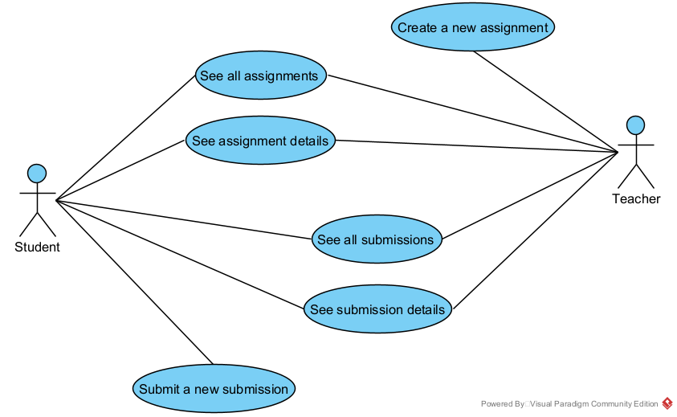
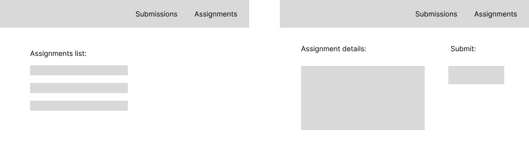
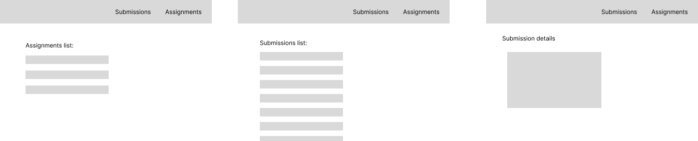
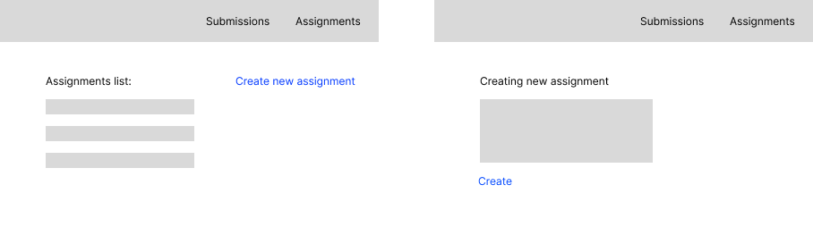
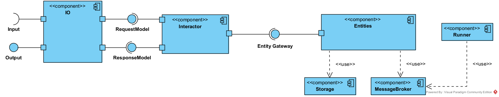
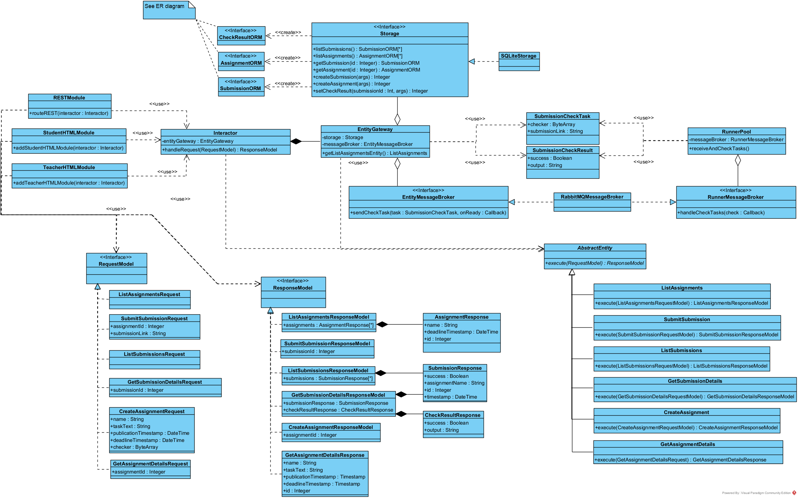
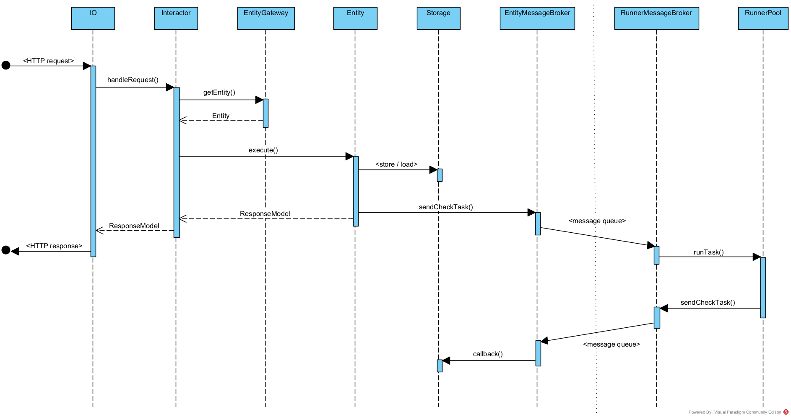
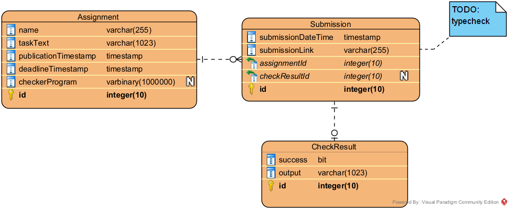

# Архитектурная документация MyHwProj

## Ключевые требования (aka drivers)

### Функциональные

* < см. постановку дз :( >
* должен быть предоставлен как веб-UI, так и REST API

### Нефункциональные

* система должна представлять собой веб-приложение
* ???

## Use-case-ы

Тут особо нечего комментировать, вместо этого предлагается взглянуть на макеты экранов по паре use-case-ов (переход слева направо):

1. Студент читает условия задания и посылает решение:
   
2. Студент смотрит детали по одному из решений:
   
3. Учитель создает новое задание:
   

## Выбор технологий

ЯП: Kotlin, потому что:

* мы с ним хорошо знакомы
* есть много полезных библиотек для написания сервера (сам сервер, ORM, HTML, ...)
* лаконичнее Jav-ы

Сервер: Ktor, потому что:

* вся необходимая функциональность есть
* специализирован для Kotlin
* с ним уже был небольшой опыт, и чтобы уложиться в короткие сроки, решили не разбираться со Spring Boot или др.

ORM: Exposed:

* Специально для Kotlin есть две альтернативы: Ktorm и Exposed. Мы посмотрели на Ktorm и его синтаксис запросов нам понравился больше, поэтому изначально мы использовали его. Но в процессе выяснилось, что из-за одной особенности не получается сделать так, как нам удобно, и пришлось переписать на Exposed.
* Стоит отметить, что любая ORM-библиотека для Kotlin по синтаксису строго удобнее любой аналогичной библиотеки на Java просто из-за отличий Kotlin-а.

## Общее описание

За основу была взята "чистая архитектура", поскольку она наиболее конкретно описывает, какие именно компоненты стоит иметь и как они должны взаимодействовать. Впрочем, некоторые ее части нам не понадобились: например, Presenter, ViewModel и View для REST-сервиса несут мало смысла. Детали см. ниже.

## Компоненты

За взаимодействие с пользователем отвечает компонент `IO`.

1. Принимает запрос от пользователя в том или ином формате (вероятно, HTTP запрос)
1. Преобразовывает его в понятный всей остальной системе класс `RequestModel`
1. Получает обратно ответ в виде класса `ResponseModel`
1. Отправляет пользователю результат запроса в том или ином формате (либо HTML страничка для веб-UI, либо JSON внутри HTTP ответа для REST-сервиса)

Полученные `ResponseModel` передаются в компонент `Interactor`, задача которого довольно проста: по типу запроса определить подходящую `Entity`, способную его выполнить, и просто передать ей этот запрос. Чтобы получить конкретный экземпляр `Entity`, `Interactor` должен воспользоваться `EntityGateway` _(на схеме это отображено как интерфейс, что не совсем корректно, но зато схема не перегружена)_.

У каждого экземпляра `Entity` есть доступ к необходимым для его работы ресурсам: `Storage` и `MessageBroker` (оба опционально; передачей этого доступа занимается `EntityGateway`).

Отдельно от всех вышеперечисленных компонентов существует `Runner`, задача которого ясна: ждать запросы на запуск программ-чекеров в очереди сообщений и эти программы запускать.

## Классы

Классы достаточно четко соответствуют компонентам, поэтому нет большого смысла заново рассказывать, что такое, например, `Interactor`. Описание же конкретных методов будет непосредственно в коде, да и к тому же названия, как правило, говорят сами за себя. Поэтому здесь будут описаны только детали.

* `RequestModel`, `ResponseModel`, `Entity` &mdash; это интерфейсы или абстрактные классы, имеющие реализации для каждого конкретного запроса пользователя. _На каждый запрос требуется существенно больше кода, чем хотелось бы, но лучше мы не придумали..._

* В классах `RESTModule`, `StudentHTMLModule` и `TeacherHTMLModule` находится описание endpoint-ов, и находится оно в локальных функциях &mdash; это продиктовано фреймворком Ktor, поэтому отдельно endpoint-ы на диаграмме классов не обозначены. Кроме этого, прямо вместе с описанием endpoint-ов можно сразу задать и автоматическую сериализацию запросов и ответов в наши классы `RequestModel` и `ResponseModel`. В связи с этим нам не нужны отдельные View или Presenter.

* `Storage` &mdash; это интерфейс для хранения данных. Различные реализации могут использовать различные БД или что угодно еще &mdash; это существенно облегчит жизнь при тестировании.  `Storage` возвращает объекты вида `xxxORM` &mdash; это обертки над ORM, которые полностью соответствуют сущностям на ER-диаграмме (и поэтому на диаграмме классов не дублируются).

* Компонент `MessageBroker` делится на два интерфейса: один посылает в очередь сообщений просьбу запустить программу-чекер (`EntityMessageBroker`), а другая эти просьбы получает и посылает результат выполнения чекера назад (`RunnerMessageBroker`).

* После выполнения программы-чекера требуется записать результат выполнения в `Storage`, однако `Runner` находится в другом процессе или даже на другой машине. Чтобы получить доступ к `Storage`, сообщения о готовности содержат callback, который должен быть выполнен в `EntityMessageBroker` при получении такого обратного соообщения.

* `AssignmentResponse`, `SubmissionResponse`, `CheckResultResponse` &mdash; это дата-классы, на самом деле тесно связанные с представлением данных предметной области (см. ER-диаграмму далее), но тем не менее имеющие свой смысл: они содержат только ту информацию, которую мы хотим послать в ответе на запрос. Аналогично классы `SubmissionCheckTask` и `SubmissionCheckResult` являются дата-классами для пересылки через очередь сообщений.

## Последовательность действий

Чтобы показать взаимодействия между классами, приведем в качестве примера диаграмму последовательностей для конкретного сценария: студент присылает решение некоторой задачи (`SubmitSubmissionRequest`).

Диаграмма не очень строго соответствует UML:

* бледно-серая линия разграничивает основное приложение и раннеров
* на цельных стрелках написан вызываемый метод, на пунктирных &mdash; возвращаемый объект

## Схема данных

На закуску &mdash; простенькая ER-диаграмма, отображающая представление данных, которые требуется сохранять на сервере.

* `Assignment.taskText` мог бы быть и PDF-файлом, но мы подумали, что это излишнее усложнение. В конце концов, преподаватель может вместо текста условия просто вставить ссылку на документ.
* `Submission.submissionLink` является ссылкой, а не просто строкой, есть смысл добавить на это проверку (об этом комментарий "typecheck" на схеме).
* В нашем понимании ТЗ, студент посылает в качестве решения именно ссылку на гитхаб, и программа-чекер принимает на вход именно ссылку.
* Как видно, в `Assignment.checkerProgram` хранится именно исполняемый бинарник. Это вызывает два вопроса:
  * Кроссплатформенность. Ответ &mdash; договоримся, что чекеры пишутся под Linux (или же являются сжатым кодом Python). В будущем при необходимости можно добавить возможность для преподавателя указать платформу, а `Runner` будет использовать один из Docker-контейнеров.
  * Интерфейс для чекера. Ответ &mdash; пусть все необходимые данные передаются через аргументы консоли, в каком именно порядке &mdash; неважно для архитектуры.
